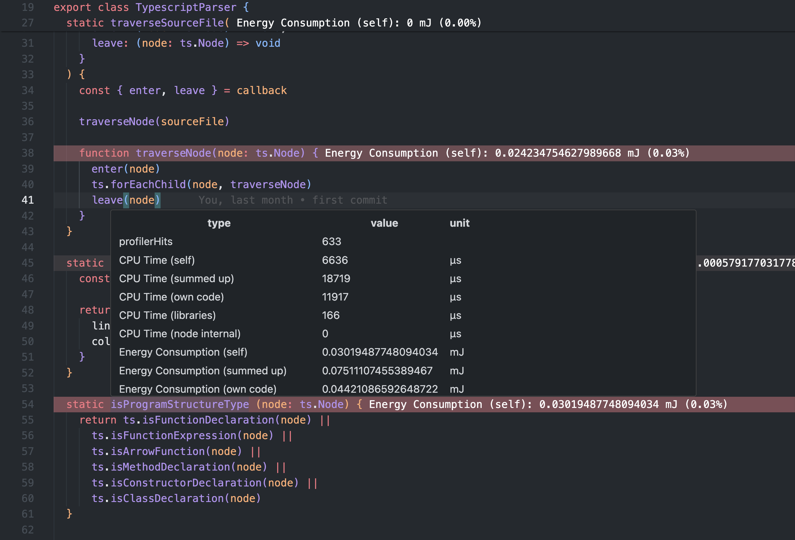
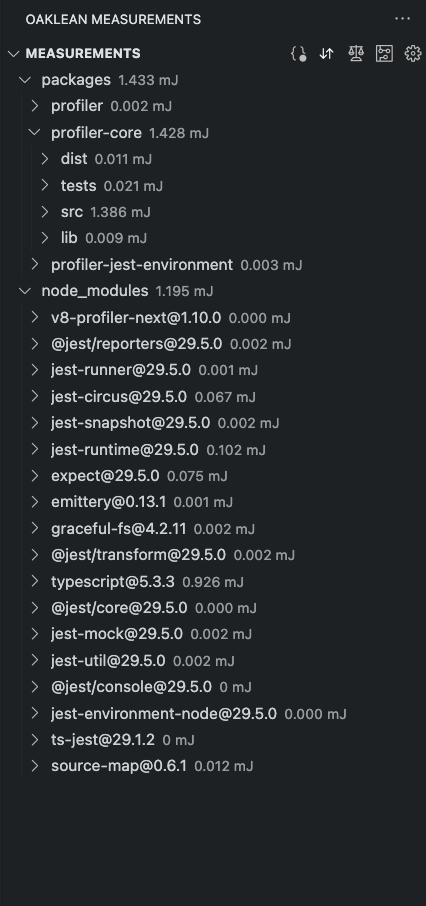

  
  

  

<!-- TABLE OF CONTENTS -->

	
Table of Contents

	<ol>
	 	<li>
			<a href="#why-oaklean">Why oaklean?</a>
		</li>
		<li>
			<a href="#first-steps">First Steps</a>
		</li>
		<li>
			<a href="#docs">Docs</a>
		</li>
		<li>
			<a href="#getting-started">Getting Started</a>
		</li>
	</ol>

## Why Oaklean?
Oaklean is a groundbreaking software solution that helps developers visualize and optimize the energy consumption of NodeJS applications. Through an innovative VSCode extension and an integration into test frameworks, the system identifies energy-intensive code sections and suggests eco-friendly alternatives. The goal is to raise awareness of responsible resource management in software development, aiming to achieve both ecological and economic benefits.

## First Steps
To see how to setup oaklean in your repository please look into [First Steps](./docs/FirstSteps.md)

## Docs
- [Fast Config Setup](./docs/FastConfigSetup.md) 
	A description of how to easily set up Oaklean for your JavaScript/TypeScript project using the [@oaklean/cli](./packages/cli/README.md)
- [Config](./docs/Config.md) 
	In depth description of the config file format
- [SensorInterfaces](./docs/SensorInterfaces.md) 
	In depth description how to use SensorInterfaces to capture energy measurements and how to measure within docker containers
- [Oaklean Profiler](./packages/profiler/README.md) 
	A description of how to set up and use the profiler to measure your code.
- [Integration into jest](./packages/profiler-jest-environment/README.md) 
	A description of how to set up and use the profiler to measure your code during jest tests.

## Getting Started
The `@oaklean` suite consists mainly of three components that help you to measure your javascript/typescript applications.

1. The `@oaklean/profiler` package helps you to measure your whole application or only some parts of it.
You can find a detailed description of how to use it [here](./packages/profiler/README.md)

2. The `@oaklean/profiler-jest-environment` package allows you to fully automate the energy measurements during your jest tests **(supported for Jest versions 28 & 29)**. This allows comparing changes in energy consumption across multiple development stages and between releases.
You can find a detailed description of how to use it [here](./packages/profiler-jest-environment/README.md)

3. The `Oaklean` VSCode Extension lets you to interpret the measurements. It integrates the energy measurements directly into your IDE.

	**You can find it here:**
	- <a href="https://github.com/hitabisgmbh/oaklean-vscode" target="_blank">VS Code Extension - Github Repository</a>
	- <a href="https://marketplace.visualstudio.com/items?itemName=HitabisGmbH.oaklean" target="_blank">VS Code Extension - Visual Studio Marketplace</a>
	- <a href="https://open-vsx.org/extension/HitabisGmbH/oaklean" target="_blank">VS Code Extension - Open VSX Registry</a>

	**Features**
	By using code highlighting it points out which source code locations consume the most energy:
		 
		
		 
		Additionally it also provides multiple features to determine the components that consume the most energy, including node modules:
		 
		
		 

## Contributing
Check out our [contributing guide](./CONTRIBUTE.md) to understand our development workflow, learn how to suggest bug fixes and enhancements, and discover how to build and test your changes in Oaklean.

## Credits
This project exists thanks to all the people who [contribute](https://github.com/hitabisgmbh/oaklean/graphs/contributors)

## License
Oaklean is [MIT licensed](./LICENSE)